##############################################################################
List
##############################################################################

If you have any concerns, please feel free to contact us via support@freenove.com

4WD Smart Car Board for Raspberry Pi
****************************************************************

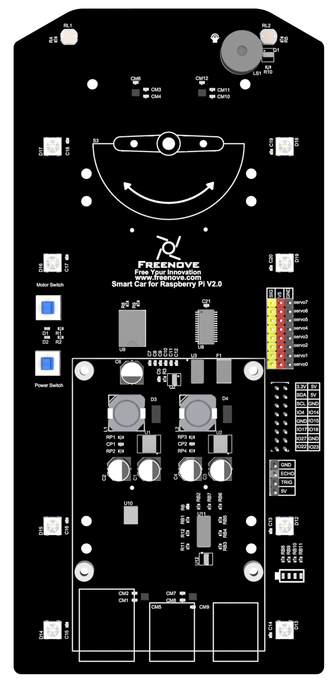

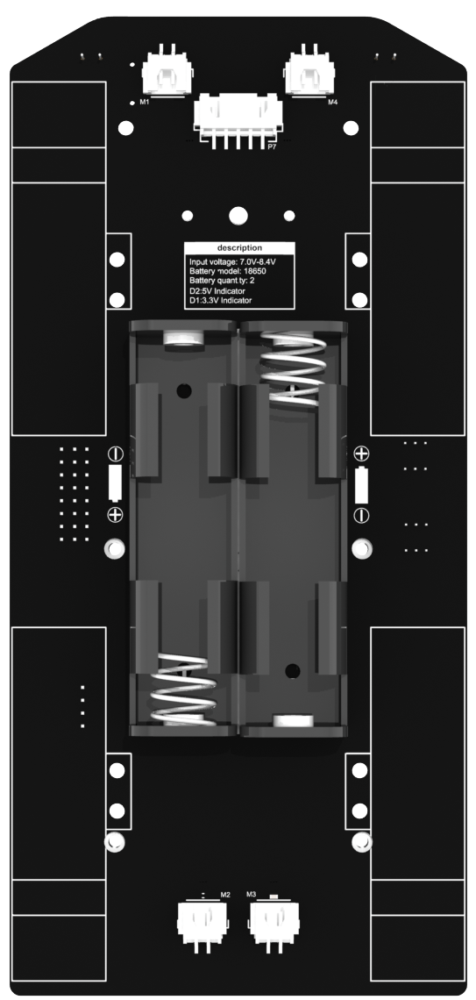

Machinery Parts
****************************************************************

.. list-table::
   :align: center

   * - |List02|
     - |List03|
     - |List04|
     - |List05|
     - |List06|

   * - |List07|
     - |List08|
     - |List09|
     - |List10|

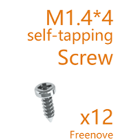
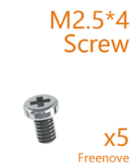
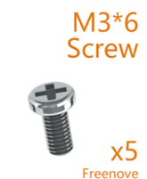
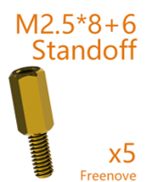
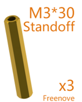
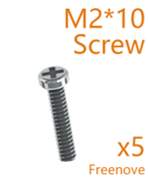
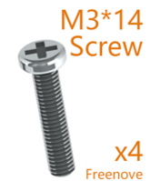
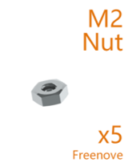
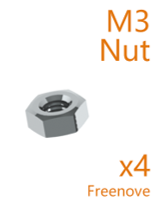

.. note::
    
    :red:`You may receive M1.4*4 or M1.4*5. Can be used normally`

Transmission Parts
****************************************************************

