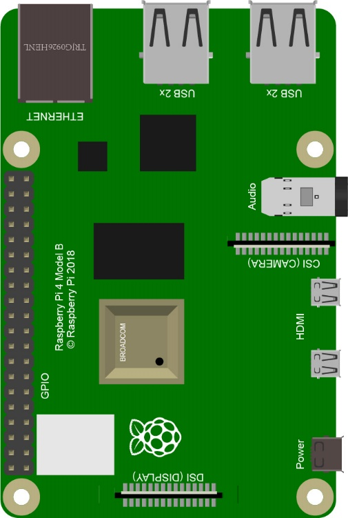

##############################################################################
Preface
##############################################################################

Welcome to use Freenove 4WD Smart Car Kit for Raspberry Pi. Following this tutorial, you can make a very cool smart car with many functions.

This kit is based on Pi Raspberry, a popular control panel, so you can share and exchange your experience and design ideas with many enthusiasts all over the world. The parts in this kit include all electronic components, modules, and mechanical components required for making the smart car. And all of them are packaged individually. There are detailed assembly and commissioning instructions in this book. 

And if you encounter any problems, please feel free to contact us for fast and free technical support.

:xx-large:`support@freenove.com`

The contents in this book can help enthusiasts with little technical knowledge to make a smart car. If you are very interested in Raspberry Pi, and want to learn how to program and build the circuit, please visit our website www.freenove.com or contact us to buy the kits designed for beginners: 

**Freenove Basic\LCD1602\Super\Ultrasonic\RFID\Ultimate Starter Kit for Raspberry Pi**

GPIO
================================================================
GPIO: General Purpose Input/Output. Here we will introduce the specific function of the pins on the Raspberry Pi and how you can utilize them in all sorts of ways in your projects. Most RPi Module pins can be used as either an input or output, depending on your program and its functions.

When programming GPIO pins there are 3 different ways to reference them: **GPIO Numbering**, **Physical Numbering** and **WiringPi GPIO Numbering**.

BCM GPIO Numbering
---------------------------------------------------------------
The Raspberry Pi CPU uses Broadcom (BCM) processing chips BCM2835, BCM2836 or BCM2837. GPIO pin numbers are assigned by the processing chip manufacturer and are how the computer recognizes each pin. The pin numbers themselves do not make sense or have meaning as they are only a form of identification. Since their numeric values and physical locations have no specific order, there is no way to remember them so you will need to have a printed reference or a reference board that fits over the pins.

Each pin's functional assignment is defined in the image below:

    .. image:: ../_static/imgs/Preface/Preface00.png
        :align: center

    .. image:: ../_static/imgs/Preface/Preface01.png
        :align: center

.. seealso:: 
    For more details about pin definition of GPIO, please refer to `<http://pinout.xyz/>`_

PHYSICAL Numbering
---------------------------------------------------------------
Another way to refer to the pins is by simply counting across and down from pin 1 at the top left (nearest to the SD card). This is 'Physical Numbering', as shown below:

.. image:: ../_static/imgs/Preface/Preface02.png
    :align: center

WiringPi GPIO Numbering
---------------------------------------------------------------
Different from the previous two types of GPIO serial numbers, RPi GPIO serial number of the WiringPi are numbered according to the BCM chip use in RPi.

.. seealso:: 
    For more details, please refer to `<https://projects.drogon.net/raspberry-pi/wiringpi/pins/>`_ 

You can also use the following command to view their correlation.

.. code-block:: console

    $ gpio readall

.. seealso:: 
    For more details about pin definition of GPIO, please refer to `<https://github.com/WiringPi/WiringPi>`_